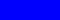
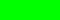
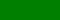

## Biome map

The biome map can be used to override the default biome generation.

Each biome is represented by a specific color. The biome Default can be used for the default biome generation.

| Color                                  | Value     | Biome         |
|:--------------------------------------:|:---------:|:-------------:|
|         | `#0000FF` | Ocean         |
|       | `#00FF00` | Meadows       |
|  | `#007F00` | Black Forest  |
|         | `#7F7F00` | Swamp         |
|     | `#FFFFFF` | Mountains     |
|        | `#FFFF00` | Plains        |
|     | `#7F7F7F` | Mistlands     |
|    | `#00FFFF` | Deep North    |
|     | `#FF0000` | Ash Lands     |
|          | `#000000` | Default          |

The colors can be changed by editing the biomemap.txt file. This is required when using custom biomes from Expand World Data mod.

## Biome File

{: .d-inline-block }
Setting
{: .label .label-green }

Path to the biomemap.png file (32 bit RGBA) and the biomemap.txt file.

For biomes, the file size doesn't matter because the actual biome values are stored instead of the image data.

### Biomemap Creation Hints

* Setup the biome colors as swatches, or a stored palette, for easy access.
* Place your heightmap on a background layer, then set your biome layers to 50% transparent.
* Use a separate layer for each biome, then you can reorder the layers if needed, and even apply layer edge effects.
* For each biome layer, fill it with the biome color entirely, then add a layer mask and paint into that, NOT the color part. This allows direct use of threshold onto the layer mask without having to convert it back and forth between color and black/white.
* Generate masks for the biomes based on height by using "Threshold". You can create a general land mask, and a mountains mask quite easily using this method. It can work for a basic Swamps mask as well.
* Improve the look of your Swamp mask by applying the water mask to it to exclude all water areas from the biome. This looks cleaner on the map and should reduce the number of enemy spawning in the water.
* If you have created a biome mask and want to grow or shrink its edges you can bake it into black and white, blur it, and then use Threshold again.
* Improve the look of the biome edges by using the smudge tool to roughen them up. After this you can reapply threshold to make the edges crisp again.

Examples

Console

Command: `bc param b fn`
 

