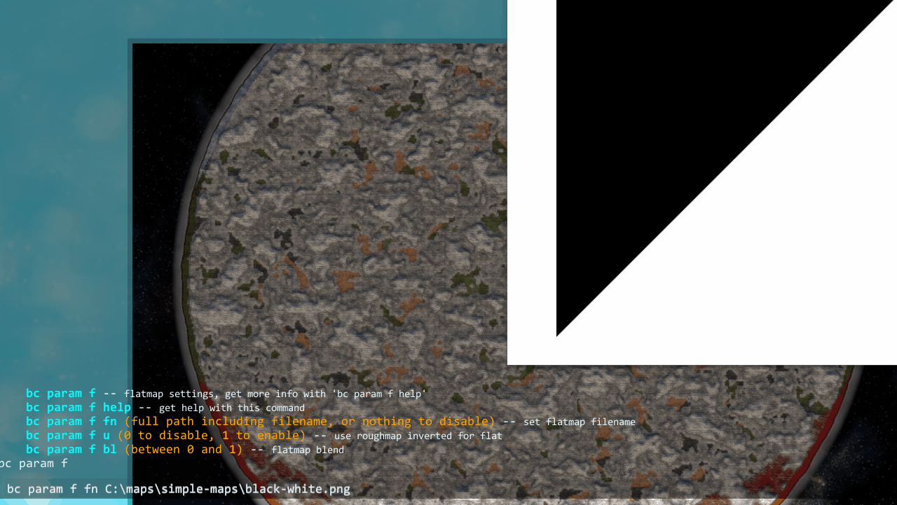
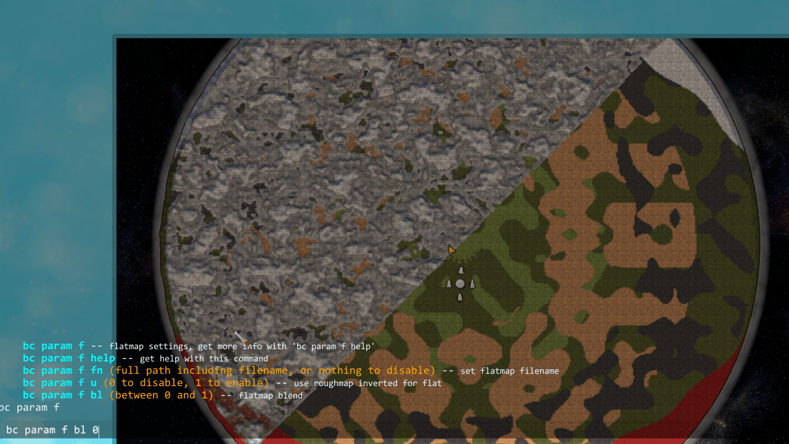

# Flatmap

The flatmap controls the smaller detail bumpiness that is applied ontop of the large scale height changes in the base height calculation. A black value in the flatmap will result in the vanilla small height variations being unmodified. A white value will result in them being removed entirely.
As the roughmap and flatmap have similar but inverted behavior (they both serve to control small scale variations in height), you can use one of them to drive the other with the "Use Rough For Flat" flag in the config. This will use the roughmap (inverted, so white is black and vice versa) as the flat map. The means if you paint all black in roughmap it will remove all extra procedural details (excluding the Ocean Channels and Rivers, which you can also toggle in the config).

## Use Roughmap For Flatmap

{: .d-inline-block }
Setting
{: .label .label-green }

Use the flatmap as the rough map, but inverted (black rough map results in totally flat terrain).
> Default true  

## Flatmap File

{: .d-inline-block }
Setting
{: .label .label-green }

Path to a flatmap file to use.

### Requirements

See [Image Requirements](../image-requirements.html) for the size and format requirements.  
8 bit grayscale Png of medium resolution would be a sensible format for a flatmap.  

Console

Command: `bc param f fn`
 

 

## Flatmap Blend

{: .d-inline-block }
Setting
{: .label .label-green }

How strongly to apply the flatmap file (also applies when using Use Roughmap For Flatmap).
> Default `1`  
> Range `0` to `1`

Console

Command: `bc param f bl`
 

