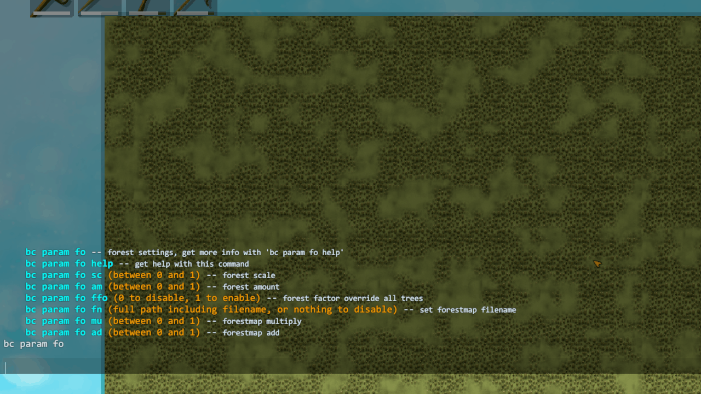
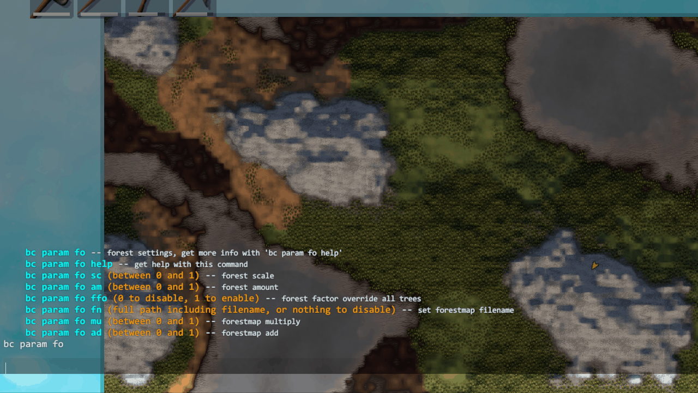
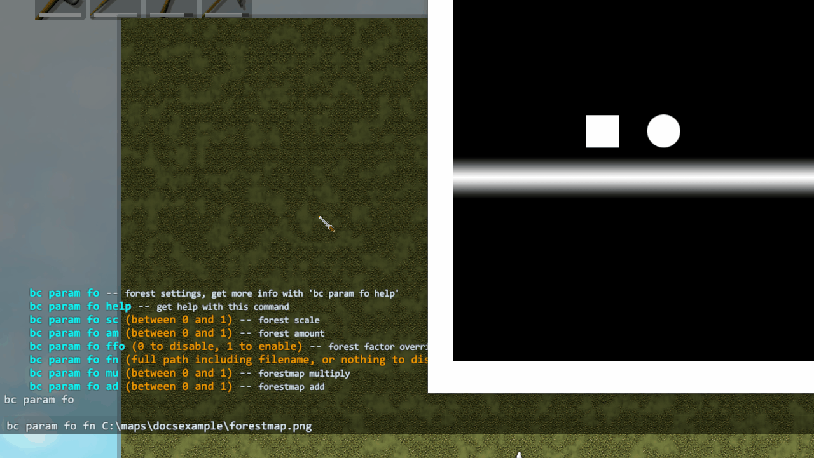
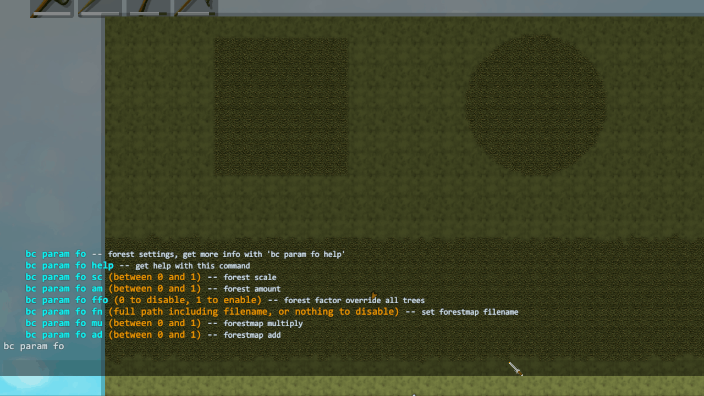
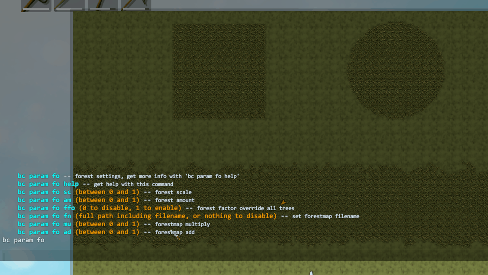

# Forest
{: .no_toc }

  

  Contents
  

  {: .text-delta }
1. TOC
{:toc}

## Forest Scale
{: .d-inline-block }
Setting
{: .label .label-green }

Scales forested/cleared area size.
> Default `0.5`  
> Range `0` to `1`

Console

Command: `bc param fo sc`

## Forest Amount
{: .d-inline-block }
Setting
{: .label .label-green }

Adjusts how much forest there is, relative to clearings.
> Default `0.5`  
> Range `0` to `1`

Console

Command: `bc param fo am`

## Forest Factor Overrides All Trees
{: .d-inline-block }
Setting
{: .label .label-green }

Trees in all biomes will be affected by forest factor (both procedural and from forestmap).  
> Default false  

Console

Command: `bc param fo ffo`

## Forestmap File
{: .d-inline-block }
Setting
{: .label .label-green }

Path to a forestmap file to use.

The forestmap controls the spawning of trees. By default this will only affect the Meadows and Plains trees (as in vanilla). You can also set "Forest Factor Overrides All Trees" to have forest factor (whether from vanilla procedural generation or the forestmap) control tree spawning in *all* biomes. i.e. You can have clearings in the Mistlands, the Swamps and even the Dark Forest! The minimap is also updated to show forest coverage on all biomes when this flag is active.

### Requirements
See [Image Requirements](../image-requirements.html) for the size and format requirements.  
8 bit grayscale Png of medium resolution would be a sensible format for a forestmap.  

Console

Command: `bc param fo fn`
 

## Forestmap Multiply
{: .d-inline-block }
Setting
{: .label .label-green }

How strongly to scale the vanilla forest factor by the forestmap.
> Default `1`  
> Range `0` to `1`

Console

Command: `bc param fo mu`

## Forestmap Add
{: .d-inline-block }
Setting
{: .label .label-green }

How strongly to add the forestmap directly to the vanilla forest factor.
> Default `1`  
> Range `0` to `1`

Console

Command: `bc param fo ad`

