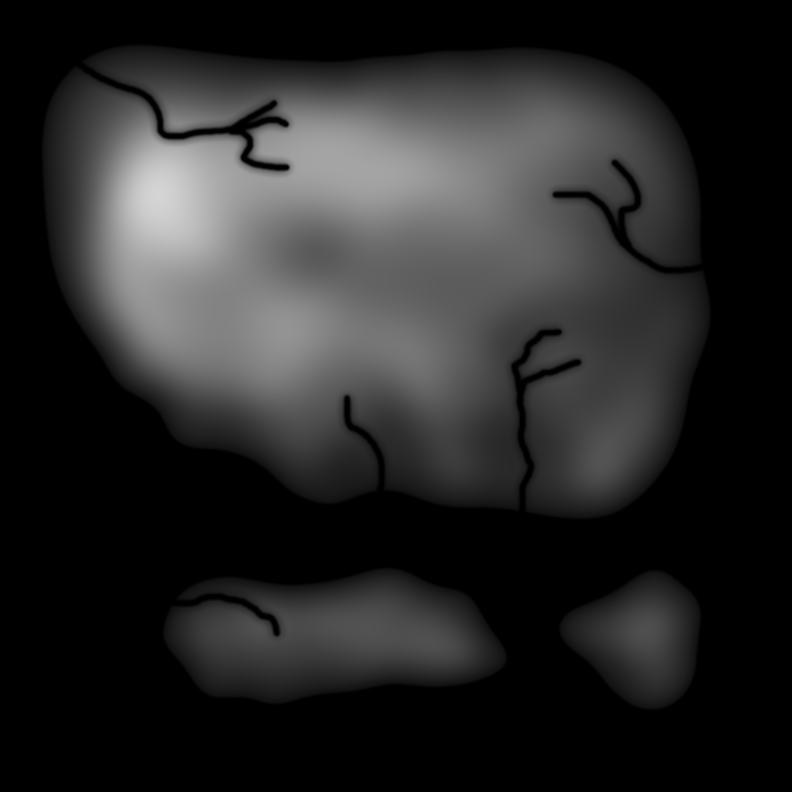

# Heightmap

{: .no_toc }

The heightmap allows direct control of the base height values for the whole map. It can blend with, or replace the base part of the vanilla proceduraly generation.  
A heightmap of 4096 x 4096 results in each pixel representing about 4 x 4 meters in game (the map size is 20 km x 20 km).  
The cloud layer in game has been determined to be at about 400 m above sealevel, meaning that an 8 bit heightmap (256 gray levels) can represent height differences of about 1.5 m. A 16 bit heightmap can represent height differences of less than  1 cm.  

Contents

{: .text-delta }
1. TOC
{:toc}

---

## Heightmap File

{: .d-inline-block }
Setting
{: .label .label-green }

Path to a heightmap file to use.

Examples

Console

Command: `bc param h fn`

### Requirements

See [Image Requirements](../faq.html#what-are-the-image-requirements-for-map-files) for the size and format requirements.  
8 or 16 bit grayscale Png of medium to high resolution would be a sensible format for a heightmap.  

### Where to get Heightmaps

* Craft them from scratch in some package. People have used Photoshop, Krita, GIMP, Blender to good affect.
* [Google](https://www.google.com/search?q=heightmap%20images&tbm=isch&tbs=rimg%3ACUrn-Sh_19QfyYckcSKAP9V2W&biw=1838&bih=1019)
* This very nice [Google Maps style page](https://tangrams.github.io/heightmapper) that will export heightmaps directly for any area on Earth.
* [World Machine](https://www.world-machine.com/): This is highly advanced heightmap generating software that can do things like physical modelling of erosion. It can also generate assist in generating biome maps automatically as well.
* [Gaea](https://quadspinner.com/): Similar to World Machine, might be quicker to get started with.

### Creation Hints

* Ensure the ocean areas of the heightmap are pure black, not grey
* Apply automatic contrast/levels to ensure the values are using the full range available
* I recommend smoothing (blurring) the image to avoid any sharp changes in altitude
* Getting sealevel looking correct might take some tweaking, of either the image itself or the sealevel setting
* To determine sealevel with your current config settings you can create a smooth gradient on the heightmap (gradient paint bucket tool in Photoshop), apply a flatish biome to it (e.g. plains), and then view it in game to determine what gray value corresponds to sealevel. In my testing with sealevel set to 25% the corresponding gray value is about #0d0d0d.
* When trying to test your map in game start with all default, then set these settings:
  * [Heightmap File](heightmap.html#heightmap-file) - paste your file name in here, or use the [Project Directory](project.html#directory) with an appropriate heightmap file in it.
  * [Ocean Channels](global.html#ocean-channels) un-ticked
  * [Rivers](global.html#rivers) un-ticked
  * [Ridges Amount](ridges.html#ridges-amount) 0%

## Heightmap Amount

{: .d-inline-block }
Setting
{: .label .label-green }

Multiplier of the height value from the heightmap file (more than 1 leads to higher max height than vanilla, good results are not guaranteed).  

> Default `1`  
> Range `0` to `5`

Console

Command: `bc param h am`

## Heightmap Blend

{: .d-inline-block }
Setting
{: .label .label-green }

How strongly to blend the heightmap file into the final result.  

> Default `1`  
> Range `0` to `1`

Console

Command: `bc param h bl`

## Heightmap Add

{: .d-inline-block }
Setting
{: .label .label-green }

How strongly to add the heightmap file to the final result (usually you want to blend it instead).  

> Default `0`  
> Range `-1` to `1`

Console

Command: `bc param h ad`

