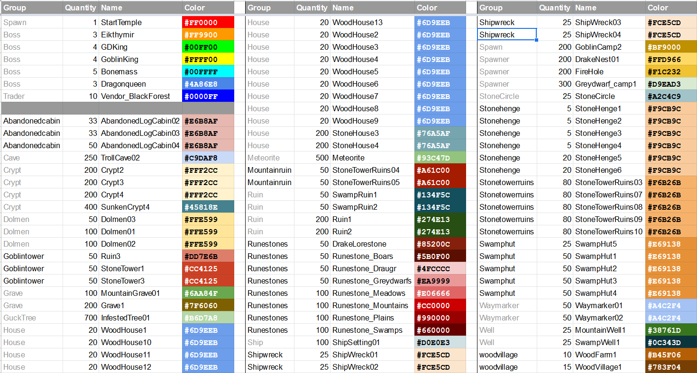

# Location map

The location map allows you to control where locations are placed when the world is created. The Location color chart below shows the various types of location that are supported, including all the start location, bosses, trader, and dungeons.

## Location map File

{: .d-inline-block }
Setting
{: .label .label-green }

Path to a location map file to use.

### Requirements

See [Image Requirements](../faq.html#what-are-the-image-requirements-for-map-files) for the size and format requirements.  
24 bit RGB Png of medium resolution would be a sensible format for a location map.  

Notes:

* The image background should be black.
* The location map colors must match *exactly* with the one specified in the table when it is loaded in game. Usually this shouldn't be a problem if you use high quality png.
* The actual spawn position is chosen from all adjacent pixels in the location map that have the same color. i.e. Every contiguous (not including diagonal) area of the same color is a single spawn location, the final position of which is a randomly chosen pixel from with the area. So you need to separate spawn areas by at least one pixel of black to stop them registering as the same area.

Location color chart

### Location map Behaviour

* All spawn positions specified in your location map will be filled, even if they exceed the max number expected by the game, so you can always be sure that all your spawn locations will be filled.
* The game will try and place all locations, prefering using the location map positions first, then using its own placement system. The only way to have ONLY location map positions filled is to place the same amount or more than the game wants to place. If you don't want that many on the map, then place them in the corners of the map where players cannot see or reach.

### Location map Creation Hints

* Bring the spawn color table into your paint tool as a separate layer, or tabbed image, for easy access. Use the eye dropper on it to quickly select a spawn color.
* Draw spawn areas using a pencil tool NOT brush, as you want a hard edge and no color variation. Use a size that can be seen easily without having to zoom in. Slight randomization of the spawn location won't matter (see the example images).
* Place your heightmap/biomemap background layers so you can easily see where you are placing spawns.
* Use a separate layer for each spawn type (bosses, markers, buildings etc.), then you can easily change the type of all of them in one go.

Console

Command: `bc param s fn`

