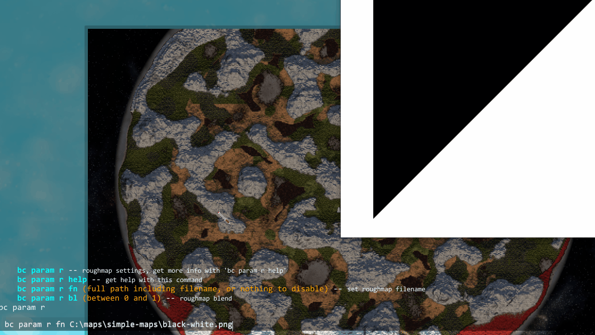
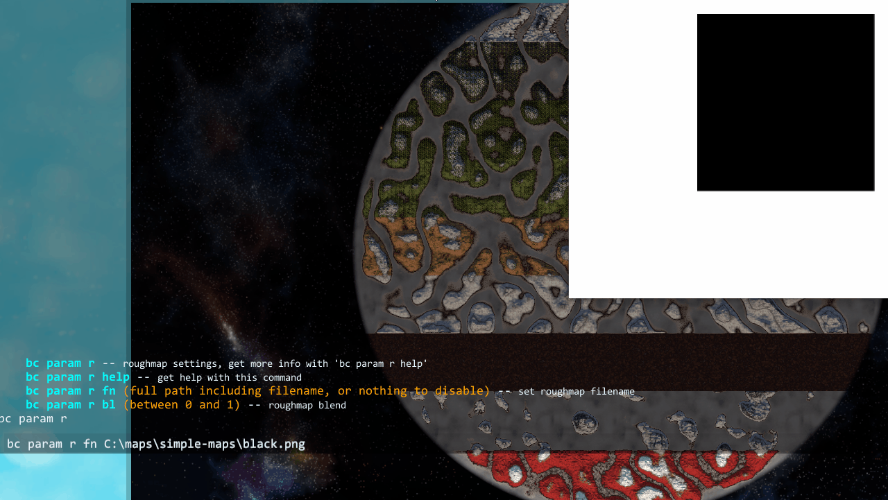

# Roughmap

The roughmap controls the strength of the vanilla biome specific heightmap variations. In vanilla each biome has its own additional height variation that is applied, for instance the swamp height is always set to about sea-level, mountains have extra large scale variation applied to generate peaks. A white value in the roughmap will result in the vanilla biome variations being unmodified. A black value will result in them being removed entirely.

---

## Roughmap File

{: .d-inline-block }
Setting
{: .label .label-green }

Path to a roughmap file to use.

### Requirements

See [Image Requirements](../faq.html#what-are-the-image-requirements-for-map-files) for the size and format requirements.  
8 bit grayscale Png of medium resolution would be a sensible format for a roughmap.  

Console

Command: `bc param r fn`

 

## Roughmap Blend

{: .d-inline-block }
Setting
{: .label .label-green }

How strongly to apply the roughmap file.
> Default `1`  
> Range `0` to `1`

Console

Command: `bc param r bl`

