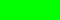
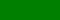
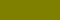
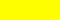

## Terrain map

By default, the ground texture is determined by the biome. The terrain map can be used to override this.

| Color                                  | Value     | Texture         |
|:--------------------------------------:|:---------:|:-------------:|
|         | `#0000FF` | Ocean         |
|       | `#00FF00` | Meadows       |
|  | `#007F00` | Black Forest  |
|         | `#7F7F00` | Swamp         |
|     | `#FFFFFF` | Mountains     |
|        | `#FFFF00` | Plains        |
|     | `#7F7F7F` | Mistlands     |
|    | `#00FFFF` | Deep North    |
|     | `#FF0000` | Ash Lands     |
|          | `#000000` | Default          |

## Terrain File

{: .d-inline-block }
Setting
{: .label .label-green }

Path to the terrainmap.png file (32 bit RGBA) and the terrainmap.txt file.

## Color mapping

Previously shown colors are based on the default terrainmap.txt file.

Color mapping is used because alpha channel is difficult to use with some image editors.

Here are the actual internal colors used by the game. For example if you want to try different values.

| Biome         | Color       |
|:-------------:|:-----------:|
| Default       | `#808080FF` |
| Ocean         | `#00000000` |
| Meadows       | `#00000000` |
| Black Forest  | `#0000FF00` |
| Swamp         | `#FF000000` |
| Mountains     | `#00FF0000` |
| Plains        | `#000000FF` |
| Mistlands     | `#0000FFFF` |
| Deep North    | `#00FF0000` |
| Ash Lands     | `#FF0000FF` |
